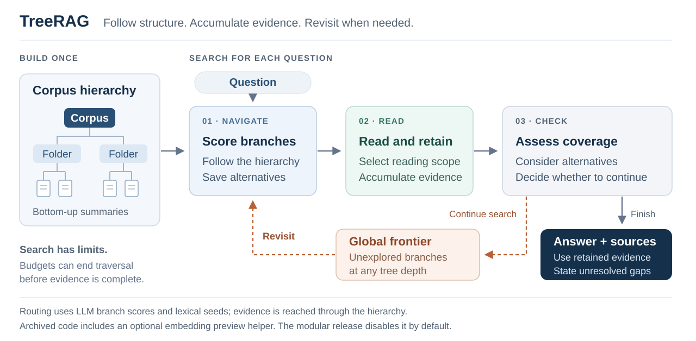

# TreeRAG: LLM-guided retrieval over corpus hierarchies

<div align="center">

[](https://github.com/asharma391/tree-rag/actions/workflows/ci.yml)
[](https://www.python.org/)
[](LICENSE)

</div>

**Navigate a document collection, retain evidence across documents, and revisit
unexplored branches when the evidence is incomplete.**

TreeRAG studies retrieval over native folder, document, section, and passage
hierarchies. An open-weight LLM scores branches and reads evidence; a bounded
controller manages memory, local reading, and a corpus-wide search frontier.



[Overview](#overview) · [Institutional study](#institutional-case-study) · [Public results](#public-results) · [Getting started](#getting-started) ·
[Reproduction](#reproducing-the-public-study) · [Custom corpora](#custom-corpora) ·
[Configuration](#configuration) · [Layout](#repository-layout) · [Citation](#citation)

## Overview

Large informational collections contain answers distributed across sections,
tables, and documents. TreeRAG builds recursive summaries while retaining the
collection's existing structure, then searches that hierarchy at query time.

1. **Rank and descend.** Score visible branches using their summaries and previews.
2. **Read and retain.** Gather passages and choose passage, section, or document scope.
3. **Check evidence.** Assess whether retained material covers the question.
4. **Recover.** Visit a promising unexplored branch when more evidence is needed.
5. **Answer with references.** Synthesize the retained evidence within search budgets.

The research centers on three connected contributions:

- **Corpus-wide recovery:** a global frontier retains unexplored branches across
  documents, supporting recovery beyond the current local descent.
- **An OICR institutional case study:** evaluated-v0 improves mean LLM-judged
  quality by **9.4 percentage points** over the deployed hybrid baseline on
  294 questions, as reported in the existing aggregate record.
- **A public-corpus evaluation:** applying the controller to 609 MultiHop-RAG news
  articles tests the approach beyond the institutional collection. The frozen
  200-question sample, outputs, and metric adapter support public inspection.

The archived evaluated implementation and the modular package remain separately
versioned; their results and safeguards are not interchangeable.

**Signal boundary.** TreeRAG does not use a dense-vector index to select evidence.
Its controller also uses lexical frontier seeding. The archived evaluated runner
contains optional embedding-based ordering of names in over-wide previews, with
a lexical fallback; the retained logs do not establish whether embedding calls
succeeded. The modular package disables that auxiliary embedding step by default.
Consequently, the archived experiment should not be described as strictly
agent-only or proven vector-free. See [architecture](docs/ARCHITECTURE.md) and
[implementation provenance](REPRODUCIBILITY.md).

## Institutional case study

On the **OICR institutional case study** (294 questions), evaluated-v0 has mean
LLM-judged quality **0.5629**, compared with **0.4686** for the deployed hybrid
baseline: a paired difference of **+0.0943**, with 95% bootstrap CI
**[0.0628, 0.1265]**. This is a difference on the judge's [0,1] quality scale,
not a binary answer-accuracy result.

These are reported values from the
[existing institutional aggregate](experiments/private_deployment_aggregate_294_20260813.json).
The current release excludes restricted questions and per-question study records,
so this aggregate is not publicly row-recomputable. The gain also comes with
higher recorded runtime; see [results and measurement limits](RESULTS.md#oicr-institutional-case-study).

## Public results

Frozen balanced sample: **200 MultiHop-RAG questions**, 50 of each type, over
609 public news articles. Retrieval metrics use the 150 non-null questions.

| System | Official QA accuracy | Hits@10 | MAP@10 | MRR@10 |
|---|---:|---:|---:|---:|
| TreeRAG evaluated-v0 | 0.495 | 0.6933 | 0.2258 | 0.4612 |
| Flat hybrid | 0.415 | unavailable | unavailable | unavailable |
| Collapsed-tree search | 0.325 | 0.4800 | 0.1058 | 0.2539 |
| Gold-context diagnostic | 0.435 | 1.0000 | 0.6700 | 1.0000 |

The official QA rule accepts any answer-token overlap and is not a semantic
correctness measure. A separate joint LLM judge gives a mean paired TreeRAG
advantage of 0.041 over flat hybrid, with 95% bootstrap CI [-0.02925, 0.11150];
this difference remains uncertain. Baselines use different retrieval and model-call
budgets, so these results do not isolate the causal effect of tree structure.
They are not full-dataset leaderboard results. The apparent 8-point official QA
gap shrinks to 1 point in a tokenization sensitivity check on the same answers;
that diagnostic is not a validated replacement metric.
[Full metrics and limitations](RESULTS.md)

## Getting started

### Install and test without a model

Use Python 3.11 or 3.12 and [uv](https://docs.astral.sh/uv/):

```bash
git clone https://github.com/asharma391/tree-rag.git
cd tree-rag
uv sync --frozen
uv run pytest -q
uv run treerag --help
```

The default installation includes query, test, and saved-result evaluation
dependencies. Document-building dependencies are installed only with `--extra build`.
The synthetic tests require neither private data nor a model endpoint. The
committed public tree is approximately 29 MB. Source installation without uv:

```bash
python -m pip install -e '.[build,test]'
```

### Query the committed tree

Configure an Ollama-compatible endpoint with the chosen model available. The
reported model is `gpt-oss:120b`, which requires substantial compute; an existing
approved remote deployment is suitable. A different model is an unmeasured setting.

```bash
export TREERAG_OLLAMA_URL=http://127.0.0.1:11434
export TREERAG_MODEL=gpt-oss:120b
uv run treerag "Which developments are compared across multiple reports?" \
  --tree data/multihop_rag_demo/corpus_tree.json --mode thorough
```

The CLI emits JSON containing the answer, source references, runtime, model calls,
and mode. For progress during a query, use:

```bash
uv run ./scripts/query_single_question.sh "Your question"
```

See [remote compute](docs/REMOTE_COMPUTE.md) for persistent sessions and a generic
SSH tunnel. No institutional account is needed to use the public corpus.

## Reproducing the public study

### Recompute saved-result metrics without model calls

The frozen question sample, answers, full TreeRAG report, and pinned official
evaluator are included. Follow the exact command in the
[experiment guide](experiments/multihop_rag/README.md#official-evaluation).
Every new evaluation writes a new output; released results remain unchanged.

### Regenerate answers with evaluated-v0

```bash
export TREERAG_OLLAMA_URL=http://127.0.0.1:11434
export TREERAG_MODEL=gpt-oss:120b
uv run --extra build ./scripts/run_multihop_benchmark.sh
```

This runs the archived controller with corrected missing-only resume scheduling
on the frozen 200-question sample and creates
a timestamped report. It requires many model calls. It does not run all 2,556
questions. The modular CLI and archived benchmark are distinct implementations;
the reported results belong to evaluated-v0.

### Rebuild the public hierarchy

```bash
export TREERAG_CACHE_DIR="$PWD/work/public-tree-$(date -u +%Y%m%dT%H%M%SZ)"
uv run --extra build ./scripts/build_tree.sh
```

This materializes the public articles, then parses and summarizes them. The
committed demonstration tree stays unchanged. The recorded full build required
19,976 model calls and 49,401 seconds. Preserve the frozen sample when downloading
data; see the experiment guide for dataset provenance and rerun limitations.

## Custom corpora

The release builder accepts a document directory and a separate cache location:

```bash
export TREERAG_DOCS_ROOT=/absolute/path/to/documents
export TREERAG_CACHE_DIR=/absolute/path/to/new/tree-cache
uv run --extra build python scripts/build_tree.py
uv run treerag "Your question" --tree "$TREERAG_CACHE_DIR/corpus_tree.json"
```

Keep original folder organization where it conveys useful structure. Run the
corpus, cache, inference endpoint, and outputs within the approved data boundary.
Never mix restricted and public caches. [Data policy](DATA_POLICY.md)

## Configuration

| Setting | Purpose |
|---|---|
| `TREERAG_OLLAMA_URL` | Model endpoint; defaults to `http://127.0.0.1:11434` |
| `TREERAG_MODEL` | Routing and answer model; defaults to `gpt-oss:120b` |
| `TREERAG_TREE_PATH` | Tree path for the modular package |
| `--mode thorough` | Primary modular configuration with larger budgets |
| `--mode quick` | Lower-budget modular sensitivity setting |
| `TREERAG_BENCHMARK_REPORT` | Explicit archived-run checkpoint to resume |

See [configuration source](src/treerag/config.py), [example environment](.env.example),
and [presets](configs). Time budgets are cooperative checks between requests,
not preemptive wall-clock deadlines.

## Repository layout

```text
src/treerag/               modular controller, typed configuration, CLI
scripts/                   query, build, and benchmark entry points
configs/                   quick and thorough environment presets
data/multihop_rag_demo/    committed public hierarchy
experiments/multihop_rag/ public sample, controls, outputs, official evaluator
reference/evaluated_v0/   archived evaluated source and provenance hashes
docs/                      architecture and deployment guidance
tests/                     offline unit, traversal, and artifact tests
```

## Provenance and next steps

This is a fork of [courtotlab/tree-rag](https://github.com/courtotlab/tree-rag),
preserving its development history. Applicable updates from the earlier personal
release have been reconciled onto that history. Historical repository contents
have not been rewritten or certified for anonymous distribution; an anonymous
review artifact requires separate inspection.

Current research gaps include human evaluation and inter-rater agreement,
equal-budget comparisons, an evaluated embedding-disabled variant, and broader
public benchmark coverage. These are open work, not completed results.

## Acknowledgements

The project grew from work in Genome Informatics at the Ontario Institute for
Cancer Research by Arjun Sharma, Jochen Weile, Kayla Marsh, and Mélanie Courtot,
with support from the University of Toronto Data Sciences Institute and the
Government of Ontario.

Source code is GPL-3.0-or-later. MultiHop-RAG data is ODC-BY; see
[the dataset card](experiments/multihop_rag/DATASET_CARD.md).

## Citation

Software metadata is in [CITATION.cff](CITATION.cff). A publication citation will
be added once available; the unpublished manuscript is not included here.
