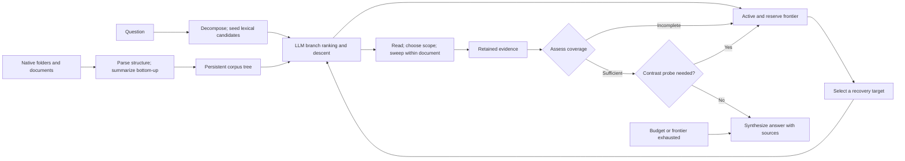

# Architecture

## Build phase

The builder preserves directory, document, and heading structure. Paragraphs, tables,
and figures become evidence-bearing leaves; summaries are created bottom-up and cached
per node. The tree is built once and amortized over future questions.

## Query phase

The controller scores a bounded candidate set with the language model, descends locally,
and retains runner-up branches globally. Reads can expand to an enclosing section and
sweep unread sections in the same document. A sufficiency gate names missing evidence. Even after a sufficient verdict, a bounded
contrast probe may send the controller back to search; it is not an unconditional
one-way step before answering. Recovery selection can prioritize a contrast target,
residual need, unvisited region, or scored frontier candidate. Source, evidence,
iteration, model-call, and cooperative time limits can also end traversal before
evidence is complete; the answer stage then uses the retained evidence. The limits
and safeguards differ between archived evaluated-v0 and the modular release.

The [README overview](../assets/treerag-system.svg) intentionally groups these
conditional checks rather than implying every search follows one fixed path.
It does not claim every child is scored, every source is cited exactly once,
or recovery always chooses the globally highest score.

## Why a native hierarchy

A governed hierarchy is stable, human-auditable, and already maintained for operational
reasons. TreeRAG tests that regime rather than claiming every corpus has a useful native
tree. Claims concern retrieval over preserved document structure; alternative
collection-level tree methods require separate matched evaluation.

## Vector-signal boundary

Evidence is not selected by nearest-neighbor lookup. The controller uses LLM
branch scores and corpus-wide lexical frontier seeds. The evaluated-v0 source
contains optional embedding ordering of names inside over-wide previews, with a
lexical fallback; the retained telemetry does not establish successful activation.
Modular-v1 defaults to zero embedding calls for that helper. Preserve these
qualifications rather than claiming the historical run was proven vector-free.
